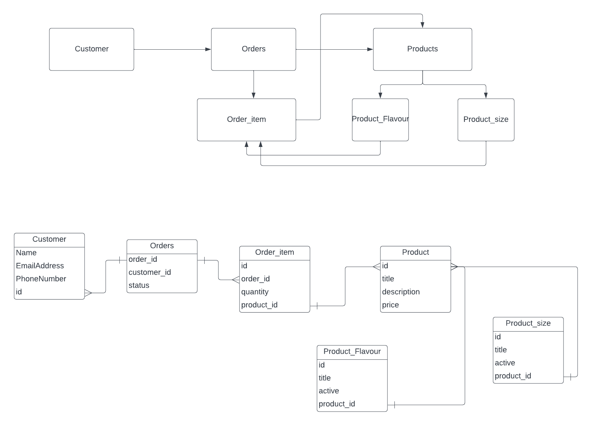

# Pizza API Service
 The Pizza API Service that maintains Marline's Pizza shop and all data storage.

 - Customer
 - Orders
 - Products

 The pizza API is a developed with [FastAPI](https://fastapi.tiangolo.com/) and served up using  [uvicorn](https://www.uvicorn.org/)

 The database used is postgres.

 The API performs basic functionality that is CRUD(Creat, Read, Update, Delete) operation.



## EKS Microservice template

If this is your first time here, please read [Our getting started guide](https://senndergmh.atlassian.net/wiki/spaces/PLE/pages/1609302474/Getting+started+with+SennCloud) first.

## What it is

This repository is the InfraOps team reference implementation of a microservice in EKS using Terraform and Helm.

## What it is not

A service template (we're basically not python developers) - tldr; everything that's under `src` : Handle with care!

## Features
- state of the art EKS deployment
- fastapi
- public endpoint (API GW)
- out of the box gitlab pipeline
- fully templated
- optional database support (RDS)
- extra cheese

## Running the service locally
Before installation ensure you installed poetry and setup a virtual environment
 ```shell
    poetry config virtualenvs.in-project true
```

After cloning the project on your development environment you will run this will install all the project dependencies.
```shell
poetry install
```
some environment variables you will use inside your `.env`file just copy this.
```shell
DB_USER=postgres
DB_HOST=localhost
DB_NAME=pizza_api
DB_PASSWORD=password
```

To spin up the service locally you can run `make serve ` this will start the service.[Docker compose](https://gitlab.com/sennder/carriers-drivers/driver-app/pizza-api/-/blob/main/docker-compose.yaml)

service configuration has two DB services:
- `make start` will start the docker database containers locally
- `pizza-api-db` bound to port 5432 - a DB for local testing,
- `pizza-api-db-test` bound to port 5433 - a DB for the project's  tests (`src/tests`).

To  create database Migration run when adding a new Model always use `alembic upgrade head` to ensure you didn't have incorrect migration or just checking if you are starting on a clean slate.
```shell
alembic revision --autogenerate -m <your migration message here/>
```
### Testing

1. Ensure development services have been started with `make serve`.
2. Run pytest with poetry:
```shell
poetry run pytest
```


**⚠️⚠️ Please use the develop branch on your first commit, otherwise you may find weird behaviours on the CI pipelines ⚠️⚠️**

**⚠️💻 If you haven't set a Personal Access Token to execute Terraform locally, check first this [link](https://sennder.atlassian.net/wiki/spaces/PLE/pages/2473459723/Using+GitLab+s+Terraform+module+registry#Local-setup)! 💻⚠️**

```sh
# Enter project directory
cd <pizza-api-app>

# Initialise git repo
git init
```

<!-- ## Setting up your dev infrastructure from local

```sh
# Change directory to iac/
cd iac/

# Plan your shared infrastructure resources (ECR)
./plan.sh shared

# Apply your shared infrastructure resources (ECR)
./apply.sh shared

# Plan your dev infrastructure resources (ECS, ...)
./plan.sh dev

# Apply your dev infrastructure resources (ECS, ...)
./apply.sh shared
``` -->

## API Gateway integration

You can access your service via the API Gateway in two environments:

| Environment   | URL                                          |
| --------------|:--------------------------------------------:|
| dev           | https://api.dev.cloud.sennder.com/pizza-api-app |
| prod          | https://api.cloud.sennder.com/pizza-api-app    |

Your service will be automatically secured via a lambda authorizer in the API Gateway. In order to access your services resources, add an 'Authorization: ' Header to your request containing a mothership token for either (staging) `https://sennder-sennder.stg.sennder.com` or (production) `https://api.sennder.com/`.

You can test your API Gateway integration as follows:

```sh
$ curl 'https://sennder-sennder.stg.sennder.com/auth/login/' \
  -H 'authority: sennder-sennder.stg.sennder.com' \
  -H 'accept: application/json, text/plain, */*' \
  -H 'content-type: application/json' \
  -H 'origin: https://app.orcas.stg.sennder.com' \
  -H 'referer: https://app.orcas.stg.sennder.com/' \
  --data-raw '{"email":"USERNAME","password":"PASSWORD"}'

{
  "key": "TOKEN"
}

$ curl -v -H "Authorization: Token TOKEN" https://api.dev.cloud.sennder.com/<pizza-api-app>/api/v1/health | jq
```

## Database integration
In case you chose the database option, your database will be automatically created once you run your pipeline.
The pipeline will pull the database secret from your CI/CD variables, please ensure that you set the `TF_VAR_database_master_password` for the environments dev and prod!
You can find the endpoint of your database in the [AWS console](https://eu-central-1.console.aws.amazon.com/rds/home?region=eu-central-1#databases:)

Your database will be set up as follows:

| Attribute     | Value                                                                                                        |
| --------------|:------------------------------------------------------------------------------------------------------------:|
| DB_HOST       | Check the [AWS console](https://eu-central-1.console.aws.amazon.com/rds/home?region=eu-central-1#databases:) |
| DB_PORT       | 5432                                                                                                         |
| DB_USER       | Your provided app-name (without '-') + env (dev|prod)                                                        |
| DB_NAME       | Your provided app-name (without '-')                                                                         |
| DB_PASSWORD   | According to your `TF_VAR_database_master_password` per environment                                          |

Those values will be automatically injected as environment variables into your ECS service.

## SonarCloud Integration
If you chose the SonarCloud Option, the SonarCloud Job has been added to your pipeline.

### You need a couple more steps to activate it!
1. Run the script in the project's root directory `sonarcloud.py`\
Which offers a handy cli which will call SonarCloud API to create project under [sennder org](https://sonarcloud.io/organizations/sennder/projects).
> Instructions on how to run the script are self-contained within the CLI.

2. Add the following env vars to your project's CI. In GitLab, go to Settings > CI/CD > Variables.
  - Define the SONAR_TOKEN = "token generated for your project after running above script"
    - Make sure that the Protect variable checkbox is unticked\
    - Make sure that the Mask variable checkbox is ticked.
  - Define the SONAR_HOST_URL = https://sonarcloud.io
    - Make sure that the Protect variable checkbox is unticked\
    - No need to tick the Mask variable checkbox this time.
